# Martian-Token-Crowdsale

I have two files:  KaseiCoin and KaseiCoinCrowdsale. I'm going to deploy them in the following way:

KaseCoinCrowdsale has two contracts in it: **KaseiCoinCrowdsale** and **KaseiCoinCrowdsaleDeployer** 

First, I deploy **KaseiCoinCrowdsaleDeployer** contract. Setting token name as KaseiCoin and token symbol as KAI. Deployer address is my injected web3 address.

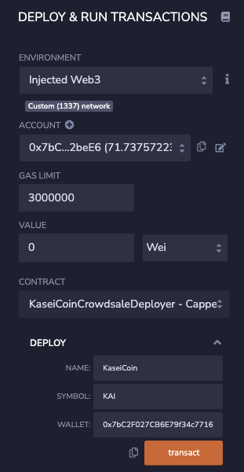

We can access KaseiCoin and KaseiCoinCrowdSale contract addresses below.

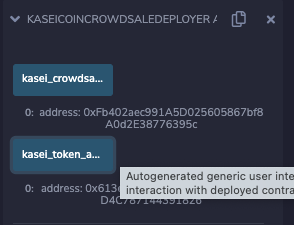

After deploying the contract I get the address for KAI token and KAI crowdsale contract. I copy token address and from contract list I choose KaseiCoin contract. I deploy this contract by clicking **At Address**.

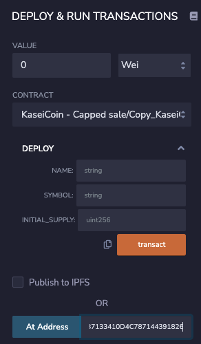

After I succesfully deploy KaseiCoin contract, we get KaseiCoin functions. Screenshot is below.

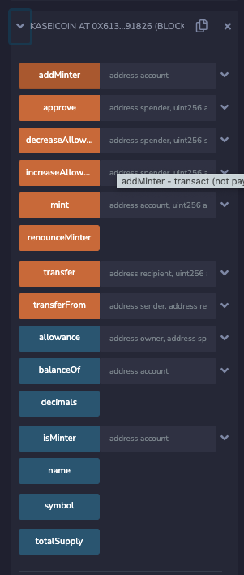

I do same deployment method for KaseCoinCrowdSale contract by choosing it from the list and using the address to deploy At Address.

After I deploy **KaseCoinCrowdSale** contract I get the following functions.

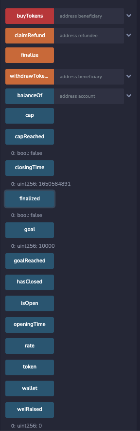

As you can see from above screenshot I also added start and **closingTime**  as well as **goal amount** to raise. I also checked the current raised wei and it shown as 0 for now. I set goal as 10000 wei and closing time as 2 hours from now. Crowdsale rate is 1 wei. 1 KAI = 1 Wei. This limits are coded in my Crowdsale contract.

Now we can start our crowdsale. Three wallets are whitelisted for this crowdsale.

**Wallet 1: 0xd9507CAd174B52f88163C19dD54c248624e07902**

**Wallet 2: 0x7B8b3D95DC2063488a9fC86841885C73e288d737**

**Wallet 3: 0xe7680715AD3249D97Aa9c330Ccb91744B053605a**

Wallet 1 is going to buy 1000 KAI and paying 1000 WEI.

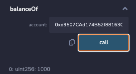

We can see successfully purchased 1000 KAI and the balance is 1000.

Now, Wallet 2 is purchasing 5000 KAI and paying 5000 WEI. Screenshot is below.

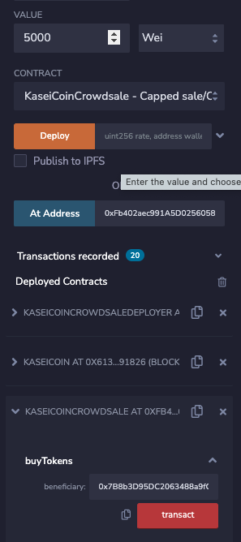 

And when we check his balance we see that it is 5000. 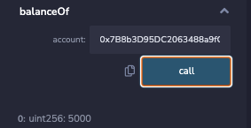

Wallet 3 has a 4000 KAI limit, but he wants to buy more. So he tries to buy 5000 KAI as well.  

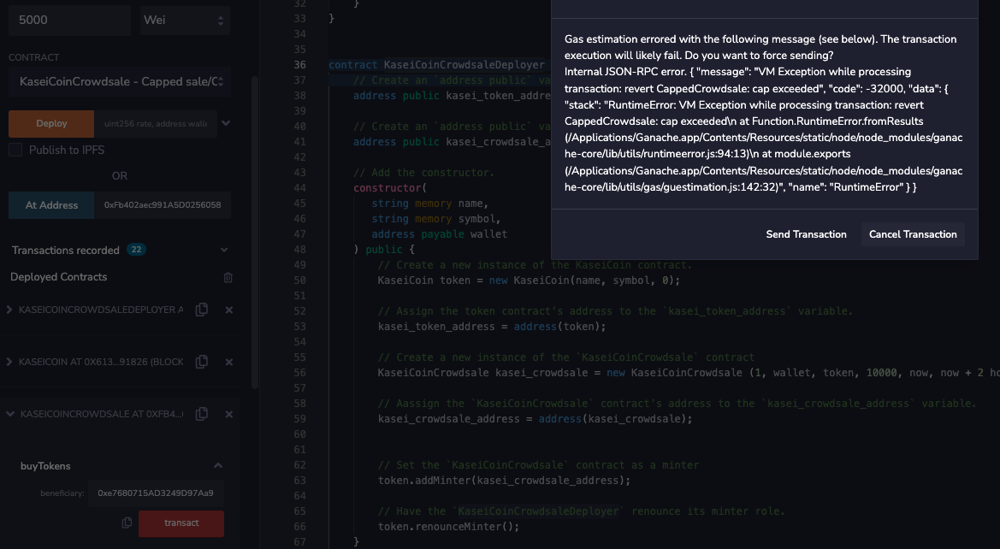

Oh no, he cannot buy more than 4000 because we have a goal of 10000 KAI to sell and 6000 tokens are already purchased by Wallet 1 and Wallet2. 

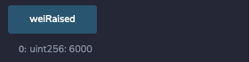

So, wallet3 tries again with 4000 KAI. And he successfully purchases 4000 KAI. 

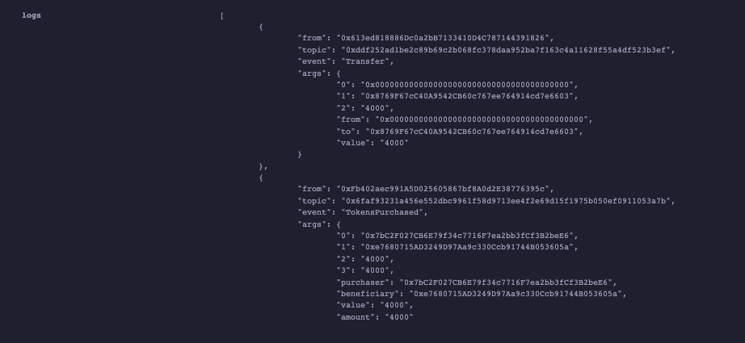

We reached our goal. All KAI tokens were sold fast. We can check it by calling **goalReached** function. 

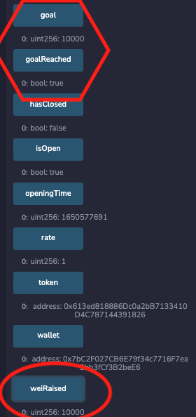

**goal: 10000**

**goalReached: true**

**weiRaised: 10000**